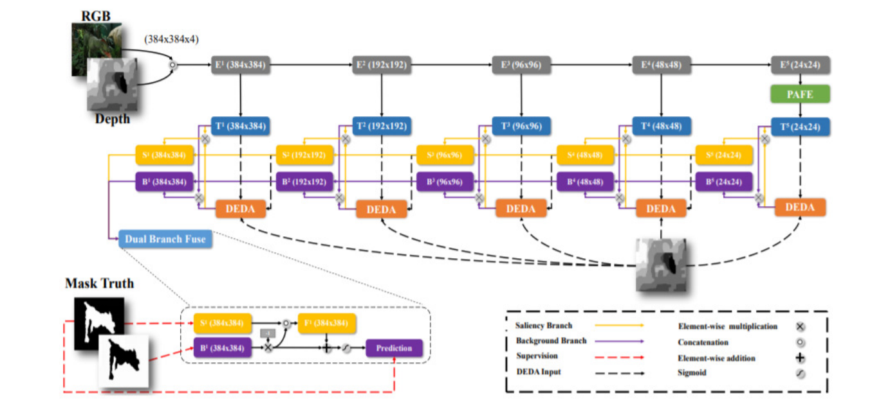
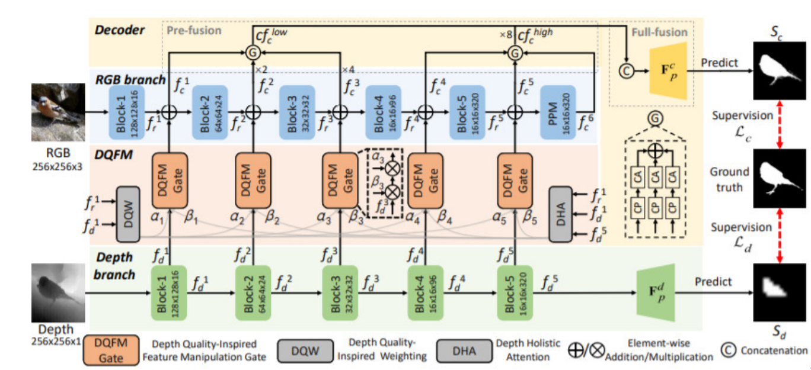
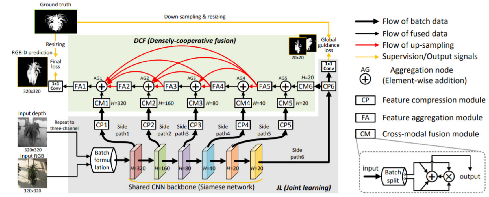

# Etude expérimentale - RGBD SOD - SYS843

La perception visuelle est la capacité du cerveau à interpréter ce que les yeux voient. Elle est 
importante dans de nombreuses activités comme la lecture, l’écriture ainsi que la manipulation 
d’objets. En plus de la perception visuelle, la perception de la profondeur nous permet de voir 
le monde en trois dimensions, d’identifier facilement et efficacement des objets, d’estimer leurs 
tailles et leurs orientations dans l’espace. Pour les robots ou encore les véhicules autonomes, la 
perception visuelle permet d’extraire des informations fondamentales sur l’environnement dans 
lequel ils évoluent. En effet, elle contribue à augmenter leur autonomie pour la navigation et la 
localisation dans un environnement inconnu. Cependant, les environnements peuvent être plus 
ou moins complexes. L’implémentation d’un mécanisme d’attention visuelle est donc 
nécessaire. Un tel mécanisme permet de déterminer une carte de saillance qui représente 
l’importance d’un stimuli visuel par rapport à son environnement.

Une approche de la vision par ordinateur qui utilise un tel mécanisme est la détection d’objets 
saillants (SOD). L’avantage de cette approche, c’est qu’elle permet de focaliser l’attention sur 
une région de l’image afin de détecter de façon robuste un ou plusieurs objets. Par conséquent, 
cette approche peut être bénéfique pour des applications telles que les robots, les véhicules 
autonomes ainsi que la vidéo surveillance. En effet, pour les véhicules autonomes un des points 
importants est de garantir la robustesse de la reconnaissance des panneaux de signalisation. 
Étant généralement de couleurs assez vives, ils attirent facilement l’attention ainsi la SOD 
permet de les détecter de façon plus robuste, ce qui contribue à la sécurité routière. De la même 
façon, pour la vidéo surveillance, la SOD permet de localiser et de capter l’évolution des 
humains et des véhicules. 

Finalement, grâce à l’émergence des capteurs de profondeur, de nombreuses techniques de 
détection d’objets saillants utilisant des images RGB-D ont été proposées. Toutes possédant 
leurs propres défis.

# Méthodes RGBD-SOD utilisées

## DANet

Le modèle DANet est un modèle de détection d'objet saillant grâce à l'utilisation d'une image (RGB) et d'une carte de profondeur. Une description plus détaillée est disponible dans le dossier `Etude_experimentale/`. Voici sa structure:


[[code](https://github.com/Xiaoqi-Zhao-DLUT/DANet-RGBD-Saliency.git)] | [[paper](https://www.ecva.net/papers/eccv_2020/papers_ECCV/papers/123670647.pdf)]

```
@inproceedings{DANet,
  title={A Single Stream Network for Robust and Real-time RGB-D Salient Object Detection},
  author={Zhao, Xiaoqi and Zhang, Lihe and Pang, Youwei and Lu, Huchuan and Zhang, Lei},
  booktitle=ECCV,
  year={2020}
}
```

## DFM-Net

Le modèle DANet est un modèle de détection d'objet saillant grâce à l'utilisation d'une image (RGB) et d'une carte de profondeur. Une description plus détaillée est disponible dans le dossier `Etude_experimentale/`. Voici sa structure:


[[code]( https://github.com/zwbx/DFM-Net.git)] | [[paper](https://arxiv.org/pdf/2107.01779.pdf)]

```
@inproceedings{zhang2021depth,
title={Depth quality-inspired feature manipulation for efficient RGB-D salient object detection},
author={Zhang, Wenbo and Ji, Ge-Peng and Wang, Zhuo and Fu, Keren and Zhao, Qijun},
booktitle={Proceedings of the 29th ACM International Conference on Multimedia},
pages={731--740},
year={2021}
}
```

## JL-DCF

Le modèle DANet est un modèle de détection d'objet saillant grâce à l'utilisation d'une image (RGB) et d'une carte de profondeur. Une description plus détaillée est disponible dans le dossier `Etude_experimentale/`. Voici sa structure:


[[code](https://github.com/jiangyao-scu/JL-DCF-pytorch.git)] | [[paper](https://arxiv.org/pdf/2004.08515.pdf)]

```
@inproceedings{Fu2020JLDCF,
title={JL-DCF: Joint Learning and Densely-Cooperative Fusion Framework for RGB-D Salient Object Detection},
author={Fu, Keren and Fan, Deng-Ping and Ji, Ge-Peng and Zhao, Qijun},
booktitle={IEEE Conference on Computer Vision and Pattern Recognition (CVPR)},
pages={3052--3062},
year={2020}
}
```

## UCNet

Le modèle DANet est un modèle de détection d'objet saillant grâce à l'utilisation d'une image (RGB) et d'une carte de profondeur. Une description plus détaillée est disponible dans le dossier `Etude_experimentale/`. Voici sa structure:


[[code](https://github.com/JingZhang617/UCNet.git)] | [[paper](https://arxiv.org/pdf/2004.05763.pdf)]

```
@inproceedings{Zhang2020UCNet,
  title={UC-Net: Uncertainty Inspired RGB-D Saliency Detection via Conditional Variational Autoencoders},
  author={Zhang, Jing and Fan, Deng-Ping and Dai, Yuchao and Anwar, Saeed and Sadat Saleh, Fatemeh and Zhang, Tong and Barnes, Nick},
  booktitle={Proceedings of the IEEE conference on computer vision and pattern recognition},
  year={2020}
}
```

# Datasets et poids des modèles

Poids des modèles: https://drive.google.com/file/d/1WxrzNBMnmFfRay9s4LAaRli2Q5THQGUp/view?usp=sharing

Dataset d'entrainement: 

- RGBDCollection pour les méthodes JL-DCF, DANet et DFM-Net: https://drive.google.com/file/d/1KZtFdJbA1hrkgh2On2OGF_tEPxQqDFx_/view?usp=sharing
- data pour la méthode UCNet: https://drive.google.com/file/d/1v99Af35qfXA76yjazpAVtV7PwyePSwZf/view?usp=sharing

A noter que les datasets d'entrainement RGBDcollection et data comportent les même données. La seule différence est que "data" possède un dossier en plus nommé "gray".

Datasets de test:

- Test sur les datasets globaux: https://drive.google.com/file/d/1bcAQ3OaMoV6ZWaa1CRfpriKjBzlKL_is/view?usp=sharing
- Test sur les sous datasets: https://drive.google.com/file/d/1Y1EDO35tXCLN4zFS5Xrm7QkIRpsGLMwQ/view?usp=sharing

# Documentation

Dans le dossier `Etude_experimentale/` vous trouverez la présentation du projet ainsi que les résultats que j'ai obtenu.